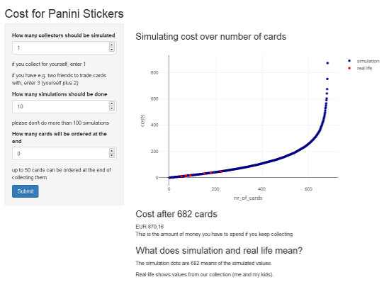

Panini Cost Simulation App
========================================================
author: Andre Dannemann
date: 19.04.2018
autosize: true

Panini - what's that all about
========================================================

Panini (<http://collectibles.panini.co.uk/home.html>) offers a collecting album for many sports events. In Europe, it is very popular to collect and trade stickers for the big soccer events, like the world soccer championship this year in Russia. 

However, collecting all stickers might get very expensive. I read an article where some professor said that collecting all 682 stickers for this event takes more than EUR 900, if no cards are traded.

First I found that interesting, then I thought, that my skills from this data science specialization should allow me to calculate that on my own...

...and they did, with even some extra functionality added.


Data and simulation approach
========================================================

- <small>draw a number between 1 and 682 with runif (random uniform)</small>
- <small>if it's not yet in the book, put it there, save the number of cards and the costs</small>
- <small>add EUR 0,18 for each number drawn</small>
- <small>if there are more than one collectors: the card is put into the internal book once for each collector and the costs are averaged.</small>

<small>This is head and tail of the resulting table</small>

```
    nr_of_cards   costs
1             1   0.180
2             2   0.360
3             3   0.540
4             4   0.720
679         679 639.288
680         680 672.660
681         681 749.880
682         682 870.156
```

Explanation of shiny app 1 / 2
========================================================

As shiny apps are not compatible with RStudio Presentations (and also not with slidify) I decided to put a screenshot here.

 


Explanation of shiny app 2 / 2
========================================================

You may choose 
- number of collectors
- number of simulations (how many books should be simulated)
- number of cards, that will be ordered at the end (it definitely saves money, not to collect until the last card)

Some insights
========================================================

- it is much cheaper when ordering the last 50 cards
- it is much cheaper, if cards are traded with other collectors

- and if these two approaches are used both, collecting a complete Panini Album is quite affordable.

Some numbers (based on 50 simulations)
- collecting alone: more than EUR 900 to collect all cards, around EUR 330 when ordering 50 cards at the end
- collecting with 5: around EUR 360 to collect all cards, around EUR 180 when ordering 50 cards at the end
